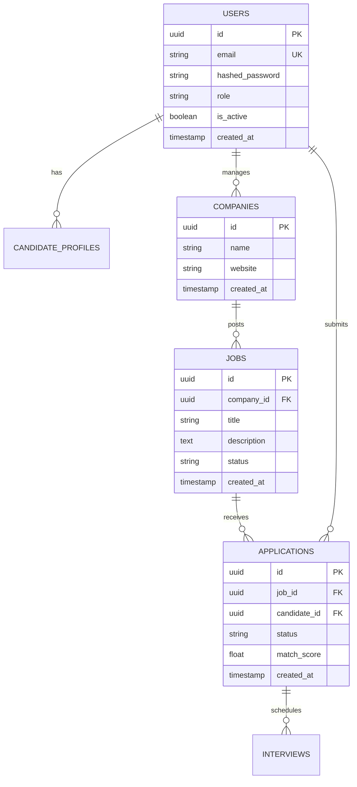

# DevHire Database Design

## Database Engine
- **RDBMS**: PostgreSQL 16
- **Driver**: `asyncpg`
- **ORM**: SQLAlchemy 2.0 (Async)
- **Migrations**: Alembic

## Entity Relationship Overview

```mermaid
erDiagram
    USERS ||--o{ CANDIDATE_PROFILES : has
    USERS ||--o{ COMPANIES : manages
    COMPANIES ||--o{ JOBS : posts
    JOBS ||--o{ APPLICATIONS : receives
    USERS ||--o{ APPLICATIONS : submits
    APPLICATIONS ||--o{ INTERVIEWS : schedules

    USERS {
        uuid id PK
        string email UK
        string hashed_password
        string role
        boolean is_active
        timestamp created_at
    }

    COMPANIES {
        uuid id PK
        string name
        string website
        timestamp created_at
    }

    JOBS {
        uuid id PK
        uuid company_id FK
        string title
        text description
        string status
        timestamp created_at
    }

    APPLICATIONS {
        uuid id PK
        uuid job_id FK
        uuid candidate_id FK
        string status
        float match_score
        timestamp created_at
    }
```
